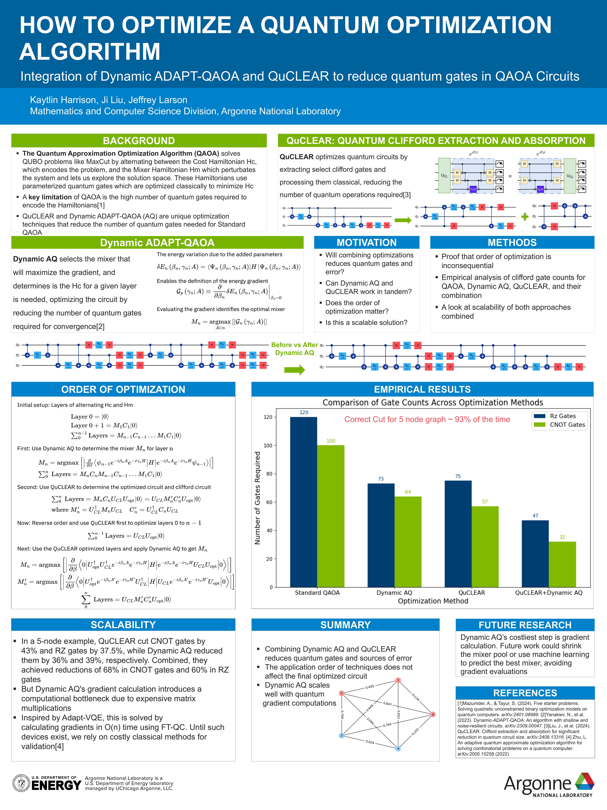

# Welcome

## Argonne Science Poster (2024)

### Abstract

Quantum computing holds great promise for addressing practical challenges. However,current quantum devices suffer from noisy quantum gates, which degrade the fidelity of quantum circuits. As a result, optimizing quantum circuits is essential for achieving useful results. In this paper, we explore the combination of two frameworks designed to optimize quantum circuits: QuCLEAR and Dynamic ADAPT ADAPT-QAOA. First, we provide an overview of both frameworks, detailing their functions, key differences, and the individual benefits of each. Second, we present a mathematical proof that combining these two methods results in a more optimized circuit, with the order of application being inconsequential. Our empirical results for a 5-node example show that QuCLEAR reduces the CNOT gates by 43% and the RZ gates by 37.5%, while Dynamic ADAPT ADAPT-QAOA achieves reductions of 36% and 39%, respectively. When combined, these methods reduce the CNOT gates by 68% and the RZ gates by 60%. Third, we compare the performance of standard QAOA with each approach individually and in tandem. Finally, we conclude with a discussion on scalability, interpretation of the results, and potential future work.

<!-- Page 1 -->
{ width=600px }

Hello!
#add Argonne poster
#add Link to undergraduate paper
#add OQI presentation link to pptx and maybe a place for a few slides
